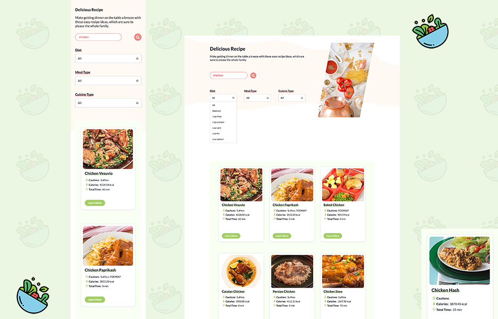

# Recipe React App

## 🎉 **[Live Demo](https://recipe-b2fdb.web.app/)** 🎉

---

---

# Description

A recipe search app using React and the EDAMAM (a global plants API) to show the recipe.

# Main Features

- Used **styled-components** to style react components, created theme and global style to make less code and more consistency
- Used Async/Await with **Axios** to fetch the [EDAMAM API](https://www.edamam.com/) data
- Used **React Hook** to perform react state and lifecycle methods inside functional components
- Created **infinite scroll** function with Intersection Observer API
- Looped through objects and arrays to display data cards
- CI/CD integration with **Firebase**
- Responsive layouts depending on device's screen size

# Credits

- Data from [EDAMAM API](https://www.edamam.com/)
- Coded by [Danica](https://github.com/wandanli)